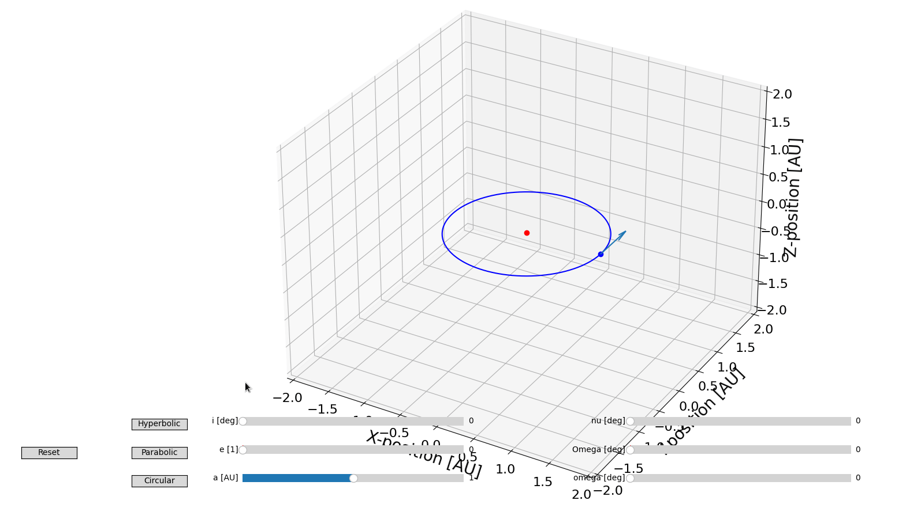

.. PyOrb documentation master file, created by
   sphinx-quickstart on Fri Jun  5 17:24:05 2020.
   You can adapt this file completely to your liking, but it should at least
   contain the root `toctree` directive.

PyOrb
=====

:Release: |release|
:Date: |today|

PyOrb is a python implementation of Kepler orbital elements and related functions. Nothing more, nothing less.

Getting started
-----------------

To install the stable public repository version

.. code-block:: bash

   pip install pyorb

alternatively we have our nightly local repository

.. code-block:: bash

   pip install X

To install directly from source, please use

.. code-block:: bash

   git clone git@github.com:danielk333/pyorb.git
   # Or alternatively
   # git clone git@gitlab.irf.se:danielk/pyorb.git
   cd pyorb
   pip install .

Then get started with this quick "getting started" guide

.. toctree::

   ipython_examples/getting_started_tutorial

Examples
---------

Example gallery of the different functionality of the package

.. toctree::
   :maxdepth: 2

   autogallery/index
   notebookgallery

Contributing
-------------

To contribute please issue pull-requests trough GitHub.

Before doing so please have a look at our [software contribution guide](https://danielk.developer.irf.se/software_contribution_guide/).

API Reference
===============

.. toctree::
   :maxdepth: 3

   api

Indices and tables
==================

* :ref:`genindex`
* :ref:`modindex`
* :ref:`search`
